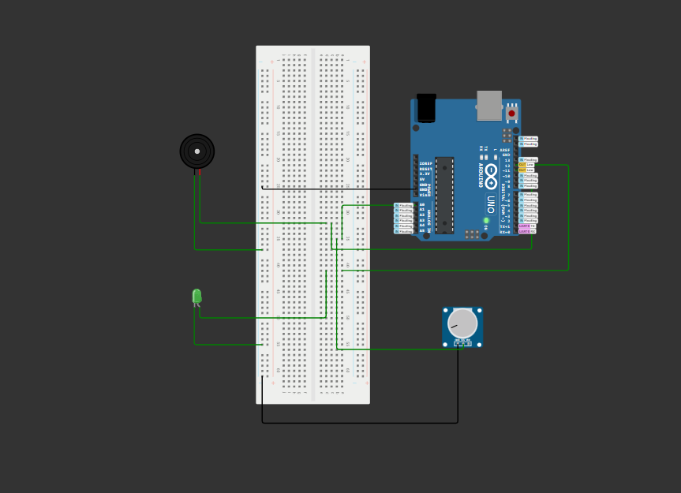
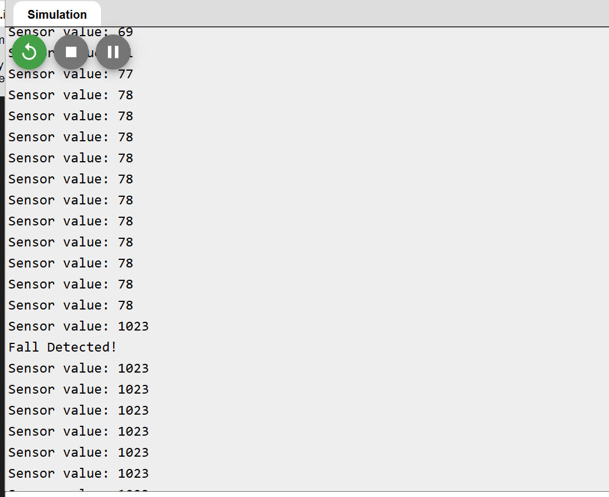

# Fall Detection System v1

Hi! I'm Kevin Bekoe and this is a simulation of a basic wearable fall detection system built using Arduino and Wokwi.  
It simulates tilt-based fall detection with alerts via LED and buzzer.

## 💡 Features
- Fall detection using a simulated tilt sensor (potentiometer)
- Real-time audio (buzzer) and visual (LED) alert
- Cooldown timer to prevent repeated triggers
- System reset message after cooldown

## 🧰 Technologies Used
- Arduino Uno
- Wokwi Online Simulator
- Active Buzzer, LED, Potentiometer

## 🔧 Components
- 1x Potentiometer (simulating tilt sensor)
- 1x Active Buzzer
- 1x LED
- Arduino Uno
- Breadboard & wires

## 🖼️ Screenshots

### Circuit Diagram

### Serial Monitor Output

## 🧠 How It Works
The potentiometer simulates a tilt sensor. When the analog signal crosses a defined threshold, a fall is detected:
- LED turns ON
- Buzzer sounds
- Serial Monitor shows "FALL DETECTED!"

After a 5-second cooldown, the system resets and prints "System Normal."

## 🚀 Future Upgrades
- Use an actual accelerometer (e.g., MPU6050) for real motion tracking
- Add GPS to send emergency location
- Integrate with a wearable design in the future

## 📚 Learning Goals
- Analog signal thresholding
- Real-time alert logic
- Arduino programming practice
- GitHub + project documentation

## Author
Made with ❤️ by Kevin Bekoe

## Site to Wokwi
//wokwi.com/projects/429693789425930241

## License
Open-source. Free for educational use.
